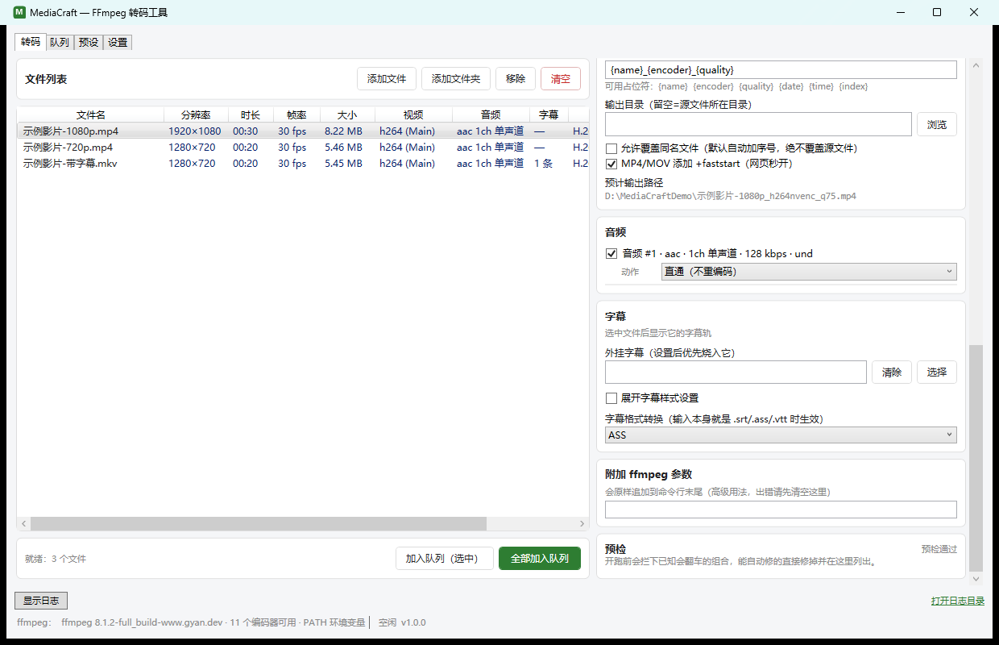
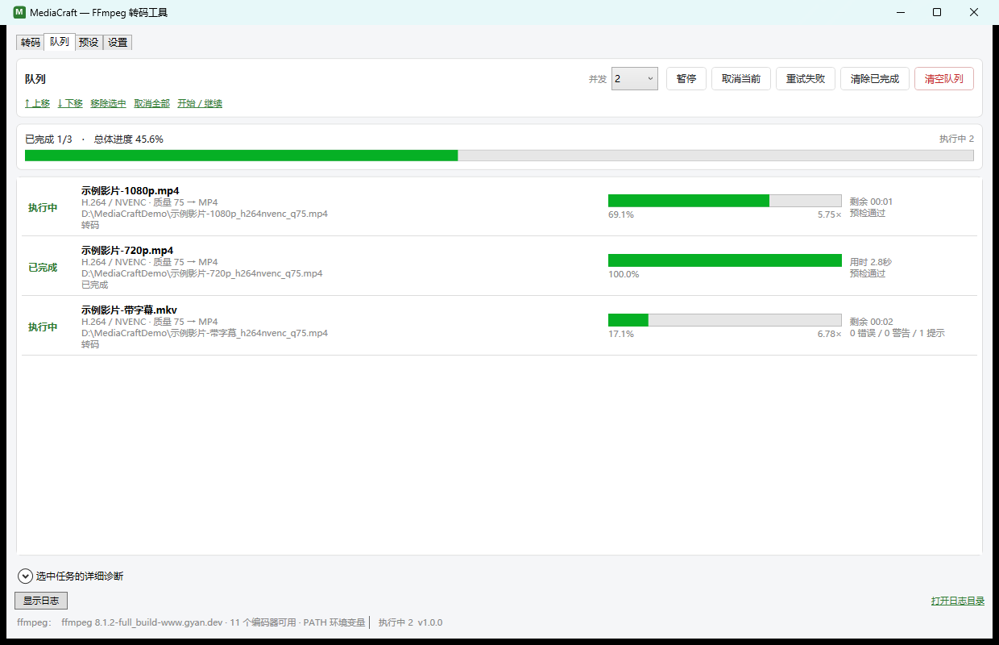

# MediaCraft

> Windows 桌面端 FFmpeg 转码工具（WPF / .NET 10），把转码当批量作业来管理。

[](https://github.com/truebigsand/MediaCraft/actions/workflows/ci.yml)

把文件或整个文件夹拖进来，选一套参数（或预设），队列自动跑完。





---

## 特点

- 每个文件持有独立的一套参数，同时提供「改参数时同步到所有文件」开关与常驻的「参数作用域」说明，
  参数改到了哪个文件上始终是明确的
- 开跑前预检：容器装不下源编码、分辨率超出编码器上限、输出路径等于源文件、单音轨容器配多条音轨等情况，
  能自动修正的修正并说明原因，不能修正的拦下不跑
- 自检里有一条用例把 171 个「容器 × 编码 × 多音轨」组合逐个真跑一遍，与代码里的兼容性表比对

## 功能

### 文件与参数

- 拖拽文件或文件夹（递归扫描）；列表显示分辨率、时长、帧率、大小、视频/音频编码、字幕数、参数摘要
- 右键菜单
  - 文件列表：加入队列、复制文件路径、在资源管理器中显示、用默认程序打开、移除
  - 队列列表：取消此任务、重试此任务、上移、下移、复制 ffmpeg 命令行、复制源文件路径、打开输出文件或位置、从队列移除
- 参数作用域常驻可见，默认「改参数时同步到列表里所有文件」，关掉即逐文件精调；添加文件后自动选中第一个
- 参数双模式：简单模式一个质量滑块（实时显示映射结果，如「滑块 75 → `-cq 23 -preset p5`」），
  高级模式直给原生参数（码率控制、CRF/CQ、preset/tune/profile/level/GOP、像素格式、附加参数）
- 多遍编码（可选）：提高码率控制精度。软件编码器走 ffmpeg 两遍（分两次调用），
  NVIDIA NVENC 用 `-multipass`、Intel QSV 用 `-extbrc` 在单次编码内完成；
  可用的编码器范围与是否要求目标码率，按实测决定并在界面直接说明
- 分辨率四种模式（保持、指定宽、指定高、框内只缩不放）、帧率、硬解方式可选
- 音轨逐条处理：直通或重编码（AAC、OPUS、MP3、AC3、FLAC、Vorbis、ALAC、PCM 16/24/32bit），
  可设码率、声道、采样率。码率控件随编码器变化：有损自由填写，AC3 只给合法档位，
  无损不显示码率而是直接算出实际码率与体积（如「24bit · 2ch · 44100 Hz → 2116 kbps，约 15.5 MB/分钟」）
- 字幕轨：内封保留、烧入画面（字体、字号、颜色、描边、位置）、提取为 srt/ass/vtt、丢弃；
  另支持外挂字幕烧入，以及把字幕文件本身作为输入做格式转换
- 输出：命名模板（`{name}` `{encoder}` `{quality}` `{date}` `{time}` `{index}`）、输出目录、
  防覆盖自动加序号（不会覆盖源文件）、MP4/MOV 可选 `+faststart`

### 队列

- 并发 1-8；暂停为停止派发新任务（ffmpeg 无法安全中途挂起）
- 排序、取消当前或全部、失败重试、清除已完成
- 逐项进度、总进度、速度、剩余时间、用时；完整命令行一键复制
- 队列持久化：退出后重开恢复未完成任务（源文件已消失的不恢复）
- 成败按进程退出码判定，失败时清理残留输出

### 诊断

- 启动时逐个「真跑一帧」探测编码器可用性（编译进去不等于能跑）
- 完整日志写 `%AppData%\MediaCraft\logs`（按天切分、保留 7 天），界面有可折叠日志面板

### 编码器

本机实测全部可用，实际取决于你的硬件。

| 来源 | 编码器 |
|---|---|
| NVIDIA NVENC | `h264_nvenc` `hevc_nvenc` `av1_nvenc` |
| Intel QSV | `h264_qsv` `hevc_qsv` `av1_qsv` `vp9_qsv` |
| CPU 软编 | `libx264` `libx265` `libsvtav1` `libaom-av1` |

### 预设

内置 14 个预设（NVENC H.264/HEVC/AV1、QSV、x264/x265、SVT-AV1、转 1080p、手机友好 720p、
纯封装不重编码、提取音频、烧入第一条字幕、提取字幕），可另存自定义、重命名、删除、导入导出 JSON。
预设存的是轨道意图（如「烧入第一条字幕」）而不是流索引，套用时按目标文件自己的轨道落实。

## 环境要求

| 项 | 要求 |
|---|---|
| 操作系统 | Windows 10 / 11（x64） |
| 运行（自包含版） | 无额外要求 |
| 运行（框架依赖版） | .NET 10 Desktop Runtime |
| 编译 | .NET 10 SDK |
| FFmpeg | 不内置，运行时自动探测：设置里指定的路径、`PATH`、常见安装位置（Scoop / winget / Chocolatey / 常见目录）；找不到时启动会提示，并可在设置页手动指定 |

推荐带硬件编码器的完整版 FFmpeg（如 `scoop install ffmpeg` 或 gyan.dev 的 full build）。
没有硬件编码器的机器上，软编编码器仍然可用。

## 快速开始

```powershell
git clone https://github.com/truebigsand/MediaCraft.git
cd MediaCraft

# 编译并运行
dotnet build MediaCraft.slnx -c Debug
dotnet run --project src/MediaCraft/MediaCraft.csproj

# 也可以直接带文件或文件夹启动（并支持资源管理器「打开方式」）
.\src\MediaCraft\bin\Debug\net10.0-windows\MediaCraft.exe "D:\videos" "E:\片子.mkv"
```

发布两种形态：

```powershell
# 自包含单文件（实测约 59 MB，目标机器无需安装 .NET）
powershell -ExecutionPolicy Bypass -File scripts\publish-standalone.ps1

# 框架依赖（体积小，需要 .NET 10 Desktop Runtime）
powershell -ExecutionPolicy Bypass -File scripts\publish-fd.ps1
```

脚本均为纯 ASCII（Windows PowerShell 5.1 会把无 BOM 的 UTF-8 当 GBK 读，中文会乱码）。
发布产物不含 ffmpeg。

## 自检

```powershell
# 纯逻辑自检：预设、参数与命名规则、格式换算，不需要 ffmpeg（约 2 秒，本地改代码后先跑这个）
.\src\MediaCraft\bin\Debug\net10.0-windows\MediaCraft.exe --selftest logic "$env:TEMP\report.txt"

# 快速自检：再加定位、能力探测、编码器功能探测、生成测试素材（约 15 秒）
.\src\MediaCraft\bin\Debug\net10.0-windows\MediaCraft.exe --selftest quick "$env:TEMP\report.txt"

# 完整自检：真跑 59 项，含 171 个容器×编码组合的兼容性矩阵（本机约 45 秒）
.\src\MediaCraft\bin\Debug\net10.0-windows\MediaCraft.exe --selftest all "$env:TEMP\report.txt"
```

日常改动的节奏是：本地跑 `logic`（秒级）与 `quick`，把 `all` 交给 CI —— 推送到 GitHub 后
Actions 会装好 ffmpeg 并跑完整自检（runner 上没有 NVIDIA / Intel 硬件，依赖硬件的用例会自动跳过），
失败时会打印报告末尾部分。发版前如果需要本地产物级验证，再用发布出来的 exe 跑一次 `all`。

退出码 0 表示全部通过。图形界面里也有「设置 → 运行快速自检」，跑完自动打开报告。
换一台机器时，跑一次快速自检即可知道本机哪些编码器可用、容器支持什么。

想在本地预演 CI 那台没有硬件的机器，设 `MEDIACRAFT_SELFTEST_NO_HARDWARE=1` 再跑，
自检会把硬件编码器当作不可用。

## 架构

```
src/MediaCraft/
├─ Program.cs              入口：单实例（Mutex + EventWaitHandle）、--selftest 分支、命令行文件参数
├─ App.xaml(.cs)           应用壳：手工 InitializeComponent、全局异常、绑定错误监听
├─ MainWindow.xaml(.cs)    四个标签页 + 可折叠日志面板 + 状态栏
├─ Ffmpeg/                 FFmpeg 层（不认识任何界面类型）
│  ├─ FfmpegLocator        定位 ffmpeg / ffprobe
│  ├─ FfmpegCapabilities   -encoders / -hwaccels 解析 + 「真跑一帧」功能探测
│  ├─ FfmpegContext        路径与能力的共享上下文
│  ├─ MediaProbe           ffprobe JSON 解析 → MediaInfo / MediaStreamInfo
│  ├─ EncoderCatalog       11 个编码器与 9 种容器的元数据、滑块映射、兼容性判定
│  ├─ FilterBuilder        滤镜链与字幕滤镜路径转义
│  ├─ TranscodeCommandBuilder  参数 → ffmpeg 参数数组（硬解分流、多轨映射）
│  ├─ PreflightValidator   开跑前预检规则
│  ├─ TranscodeRunner      进程执行：进度解析、取消、残留清理
│  ├─ ProgressParser       -progress pipe:1 解析
│  └─ SelfTest             无头自检（含兼容性矩阵校验）
├─ Media/                  领域模型：TranscodeParams、输出路径、文件夹扫描
├─ Queue/                  队列引擎与持久化
├─ Presets/                预设模型与仓库（内置 + 用户 + 导入导出）
├─ Settings/               设置模型与持久化
├─ ViewModels/             视图模型（CommunityToolkit.Mvvm）
└─ Views/                  四个页面（XAML）
```

依赖方向单向：`Views → ViewModels → (Queue | Presets | Media) → Ffmpeg`。
唯一的 NuGet 依赖是 `CommunityToolkit.Mvvm`。

## 数据位置

| 内容 | 位置 |
|---|---|
| 设置 | `%AppData%\MediaCraft\settings.json` |
| 预设 | `%AppData%\MediaCraft\presets.json` |
| 队列 | `%AppData%\MediaCraft\queue.json` |
| 日志 | `%AppData%\MediaCraft\logs\app-yyyyMMdd.log`（保留 7 天） |

## 已知限制

- 只驱动本机 ffmpeg，不支持远程或 SSH 执行（执行层已抽象，后续可加）
- 暂停不会挂起正在跑的 ffmpeg，只是停止派发新任务；取消会杀进程树并清理残留
- 不做色调映射：HDR 源转 SDR 会发灰（预检会提示）
- 图形字幕（PGS / DVD）不能烧入，也不能提取为文本（需要 OCR，预检会拦下）
- 不做两遍编码、不做画面滤镜（降噪、去隔行等）、不做剪辑合并
- 无托盘常驻，关窗即退出

## 工程纪律

1. 后台回调一律切回 UI 线程（队列可见状态只在 UI 线程修改），UI 线程不做慢调用
2. 锁内不调外部组件
3. 成败只看进程退出码，不按文件是否存在判断
4. 删除残留输出前先确认该文件在任务开始前不存在，不删用户原有文件
5. 输出路径与源文件相同时预检直接拦下
6. 涉及外部工具行为的结论以实测为准，并写进 `docs/spec.md`
7. `scripts/*.ps1` 保持纯 ASCII
8. 设置保存用 500ms 防抖，退出时强制保存

设计与实测记录见 [docs/spec.md](docs/spec.md)。
